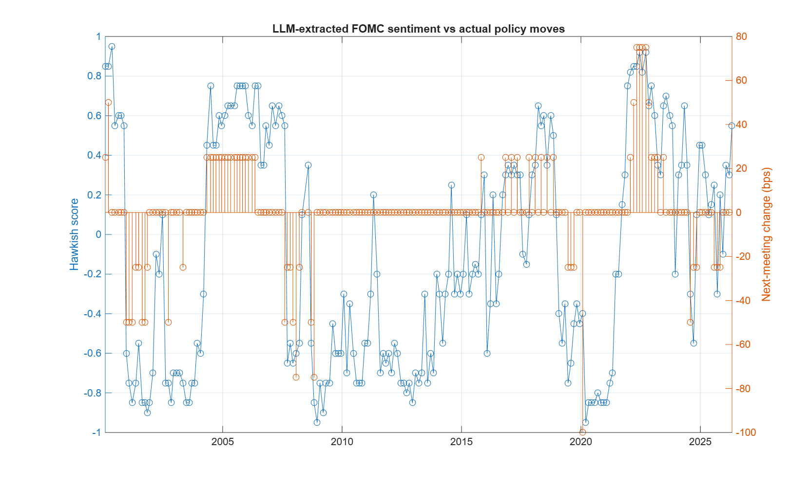

## DISCLAIMER Development notes: AI assistance

The README and the descriptive comments at the top of each source file were
drafted with the assistance of Anthropic's Claude, consistent with the
program's [Generative AI Guidelines](https://github.com/mathworks/MATLAB-Simulink-Challenge-Project-Hub/wiki/Generative-AI-Guidelines).
All content was reviewed and edited by the author. Claude is also a runtime
component of the system itself (`callClaude.m`).
# FOMC Minutes Analysis with LLMs (MATLAB RAG Pipeline)

A MATLAB-based retrieval-augmented generation (RAG) system that analyzes 26 years
of Federal Open Market Committee meeting minutes, answers natural-language questions
about monetary policy grounded in the source documents, and extracts hawkish/dovish
sentiment scores that are backtested against the Fed's actual rate decisions.

Built for [MathWorks Challenge Project #258](https://github.com/mathworks/MATLAB-Simulink-Challenge-Project-Hub/tree/main/projects/Federal%20Open%20Market%20Committee%20Minutes%20Analysis%20with%20Large%20Language%20Models).

## Results

LLM-extracted sentiment vs. actual next-meeting policy moves, 2000–2026:



| Metric | Value |
|---|---|
| Meetings analyzed | 211 (2000–2026) |
| Corpus size | 12,000+ embedded text chunks |
| Spearman correlation (sentiment vs. next rate change) | **0.568** |
| Directional hit rate on actual rate moves | **94.0%** (63/67) |

The corpus updates itself: re-running the pipeline scrapes and scores any newly
published FOMC minutes automatically.

## Architecture

```
federalreserve.gov ──► step1: scraper ──► raw HTML (211 meetings)
                              │
              step2: extract → chunk by paragraph → embed (all-MiniLM-L12-v2, 384-d)
                              │
                   PostgreSQL + pgvector (HNSW index)
                              │
      step3: RAG Q&A ── cosine retrieval + date filtering ──► Claude API
                              │
      step4: sentiment scoring ──► backtest vs FRED rate data
```

## A bug worth mentioning: the January problem

The first version of the sentiment scorer fed each meeting's *first 25 chunks* to
the LLM. Result: January meetings systematically scored 0.00. Why? January FOMC
meetings are annual organizational meetings — their opening pages are attendance
rosters and legal boilerplate (foreign-currency authorization renewals), not policy
discussion. The LLM correctly found no signal in a phone directory.

Fix: select chunks by *relevance* instead of position — embed a policy probe query
("inflation outlook, economic conditions, and the appropriate stance of monetary
policy") and retrieve each meeting's 25 most similar chunks via pgvector.

Effect: Spearman 0.556 → 0.568, directional hit rate 88.1% → 94.0%, and January
meetings now score consistently with their era.

## Setup

Requirements: MATLAB R2024a+ (Text Analytics, Database, Statistics & ML, Deep
Learning toolboxes), the all-MiniLM-L12-v2 support package, PostgreSQL with
[pgvector](https://github.com/pgvector/pgvector), and an Anthropic API key.

1. Create the database: `psql -U postgres -f sql/setup_database.sql`
2. Download rate data from FRED into `data/`:
   [DFEDTAR](https://fred.stlouisfed.org/series/DFEDTAR) and
   [DFEDTARU](https://fred.stlouisfed.org/series/DFEDTARU) (full history)
3. In MATLAB, set credentials each session:
```matlab
   setenv("FOMC_DB_PASSWORD", "your-postgres-password")
   setenv("ANTHROPIC_API_KEY", "sk-ant-...")
```
4. Run `src/main.m` — it executes the full pipeline (scrape → embed → RAG demo →
   backtest) with skippable stages. Individual step scripts can also be run directly.

All scripts are re-runnable; completed work is skipped.

## Design notes

- **Custom API client** (`callClaude.m`): a minimal webwrite-based Anthropic client
  (~25 lines) rather than a wrapper library — every request field is explicit.
- **Metadata-aware retrieval**: chunks carry meeting dates, so questions like
  "what worried the Fed in 2022" filter by date before similarity ranking.
- **Rate-regime stitching**: pre-Dec-2008 target rate (DFEDTAR) and post-2008
  upper bound (DFEDTARU) are merged into one continuous ground-truth series.

## Limitations

- LLM training data includes historical knowledge of Fed decisions, so scores are
  not pure out-of-sample forecasts; the claim tested is that the minutes *contain*
  extractable policy signal, not that the system predicts blind.
- Sentiment is scored per meeting in isolation; no cross-meeting context.

## License

MIT
